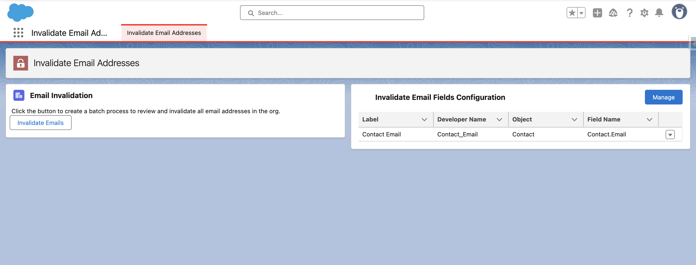

# Salesforce Email Invalidator

A simple tool to invalidate all the email addresses in your Salesforce org. This is meant to be used in Sandboxes to avoid accidentally sending email to everyone in the org (which comes up more than people expect).

Currently this tool consists of unpackaged metadata. At some point I'll work on getting it packaged, but this is still an early draft.

## Installation

Currently this project just uses loose metadata and is not packaged. To install it, you need to clone this repo, or download its content. Then using sf cli run: `sf project deploy start`

## Main App

The project provides an Invalid Email App which shows a list of the fields that are setup to be invalided, and a Lightening Web Component to initiate the process of adding `.invalid` to the end of all values in that field.

You can add Custom Metadata records to list all email fields on any object, so all emails can be disabled.

You can find the app in the app switcher by searching for `Invalidate Email`.

## Permission Set

Anyone you want to be able to use this process should be assigned the included Invalidate Emails permission set.

## Sandbox Post Copy Process

There is also a SandboxPostCopy class you can use to have the process run as soon as a Sandbox refresh or create completes. This is only useful in a full or partial copy sandbox.

When you create a sandbox there is a field that allows you to indicate classes you want run after the process completes. Enter `InvalidateEmailSandboxPostCopy` and the process defined here will run.

## Planned Features

- Scan for Email Fields: It would be helpful to have a process that scans the org for email fields and adds custom metadata records for those fields to the system.
- Un-Invalidate Fields: Adding `.invalid` is helpful. It would also be nice to easily remove it again under some conditions.

Suggestions welcome. Please create a new [Issue](https://github.com/acrosman/SalesforceInvalidateEmail/issues) and submit your ideas.
